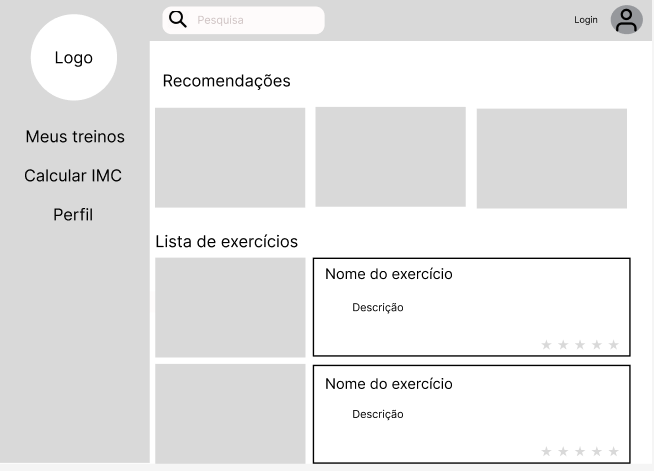
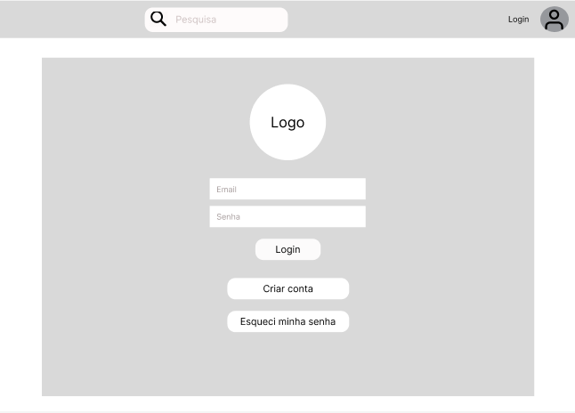
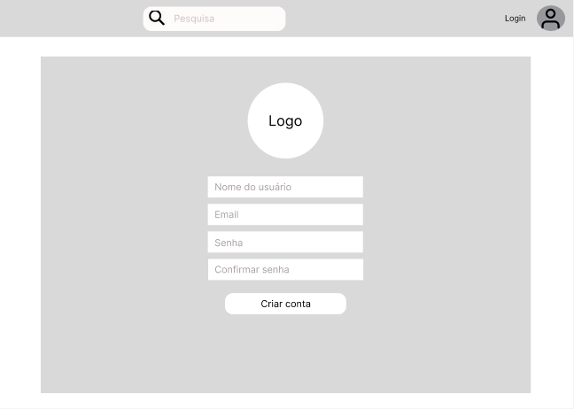
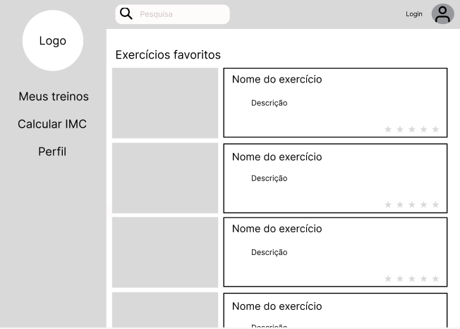
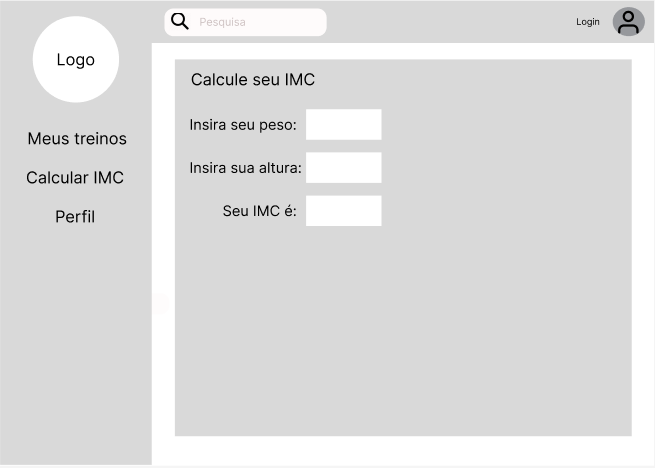
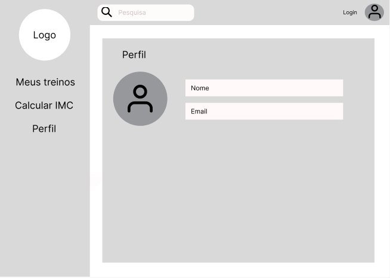

# Projeto de Interface

Pré-requisitos: <a href="2-Especificação do Projeto.md"> Documentação de Especificação</a>

Visão geral da interação do usuário pelas telas do sistema e protótipo interativo das telas com as funcionalidades que fazem parte do sistema (wireframes).

 Apresente as principais interfaces da plataforma. Discuta como ela foi elaborada de forma a atender os requisitos funcionais, não funcionais e histórias de usuário abordados nas <a href="2-Especificação do Projeto.md"> Documentação de Especificação</a>.

## Diagrama de Fluxo

O diagrama de fluxo na figura 1, criado na ferramenta Figma, ilustra a sequência de de ações e interações do usuário à medida que ele navega pelo sistema. O diagrama também facilita um bom planejamento das interações, resultando em uma boa experiência ao usuário.

<figure>
 <figcaption>Figura 1 - Diagrama de fluxo da aplicação.
 </figure>
 

## Wireframes

### Tela principal
Na tela principal é onde o usuária irá encontrar recomendações de exercicos, a lista de exercios, um menu lateral para navegar nas outras telas e uma barra de pesquisa, para encontrar exercicos que o usuário queira.

### Tela de log in
NA tela de log in o usuário poderá entrar em sua conta ou, caso ainda não tenha, poderá se cadastrar.

### Tela de cadastro
Na tela de cadastro o usuário poderá fazer seu cadastro, caso ainda não tenha.

### Tela de exercícios favoritos
Na tela de exercícios favoritos o usuário poderá acessar seus exercícios adicionados ao favorito.

### Tela de calculo de IMC
Na tela de calculo de IMC o usuário poderá inserir seu peso e sua altura para descobrir seu IMC.

### Tela de perfil
Na tela do perfil o usuário poderá acessar seu perfil.

